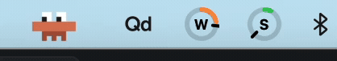
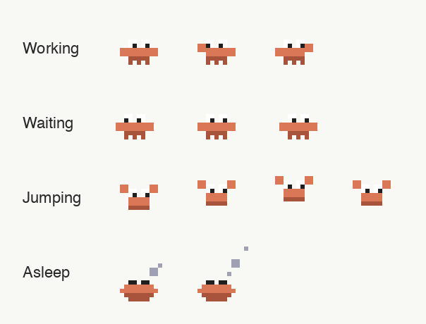
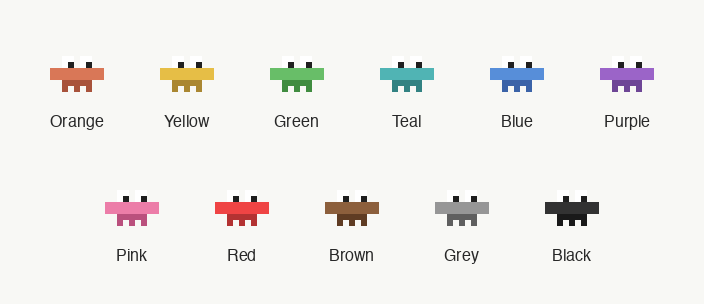

# CrabCodeBar Universal

A cross-platform animated pixel crab that lives in your system tray and reacts to [Claude Code](https://claude.com/claude-code) session activity in real time. Works on macOS, Windows, and Linux.



## What it does

CrabCodeBar watches your Claude Code sessions via hooks and shows what's happening at a glance:

| State | Trigger | Animation |
|---|---|---|
| **Working** | Tool use, prompt submission | Claws typing, eyes darting |
| **Jumping (approval)** | Notification or blocking tool | Bouncing with raised claws |
| **Jumping (finished)** | Task completed | Brief celebratory bounce |
| **Waiting** | Session idle (recent) | Pacing side to side |
| **Asleep** | No activity for 5 min (configurable) | Curled up with rising Z's |



Right-click the tray icon for options: body color, notification sounds, sleep timer, and quit.



## Prerequisites

- Python 3.8+
- [Claude Code](https://claude.com/claude-code) CLI or VS Code extension
- **Linux only:** system packages for tray support (see Linux section below)

## Install

```bash
git clone https://github.com/MatthewBentleyPhD/CrabCodeBar-Universal.git
cd CrabCodeBar-Universal
python3 install.py
```

The installer will:
1. Check Python version
2. Install pip dependencies (Pillow, pystray, pyobjc on macOS)
3. Generate sprite images
4. Register Claude Code hooks in `~/.claude/settings.json`
5. Register auto-start on login

Then launch:
```bash
python3 crabcodebar.py
```

The crab appears in your system tray. It will start automatically on future logins.

### Install without auto-start

```bash
python3 install.py --no-autostart
```

## Uninstall

```bash
python3 install.py --uninstall
```

This removes:
- Claude Code hooks from `~/.claude/settings.json`
- Auto-start entry (LaunchAgent / Startup folder / XDG autostart)
- State and config files from `~/.claude/state/`
- Stops any running instance

The application folder itself is not deleted. Remove it manually if you want a complete cleanup.

## Update

If installed via git clone:

```bash
python3 install.py --update
```

This pulls the latest changes and reinstalls hooks, dependencies, and sprites.

## Configuration

Right-click the tray icon to access settings:

- **Sprite Color:** 11 color options (orange, yellow, green, teal, blue, purple, pink, red, brown, grey, black)
- **Approval Sound:** notification sound when Claude needs input (macOS system sounds; system beep on Windows; freedesktop sounds on Linux)
- **Finished Sound:** notification sound when a task completes
- **Sleep After:** idle timeout before the crab falls asleep (30s to 1 hour, or never)

Settings are saved to `~/.claude/state/crab-config.json` and persist across restarts.

## Linux dependencies

pystray on Linux requires GTK and AppIndicator libraries. Install them before running `install.py`:

**Debian/Ubuntu:**
```bash
sudo apt install python3-gi gir1.2-appindicator3-0.1
```

**Fedora:**
```bash
sudo dnf install python3-gobject libappindicator-gtk3
```

**Arch:**
```bash
sudo pacman -S python-gobject libappindicator-gtk3
```

The installer will check for these and prompt you if they're missing.

## How it works

CrabCodeBar uses [Claude Code hooks](https://docs.anthropic.com/en/docs/claude-code/hooks) to track session activity:

1. **Hooks** fire on Claude Code lifecycle events (session start/end, tool use, prompts, notifications, task completion)
2. **hook.py** receives each event, validates it against the known event list, and writes the current state to `~/.claude/state/crab.json`
3. **crabcodebar.py** polls that file using mtime-based change detection and updates the tray icon animation only when frames change

Only one instance runs at a time (kill-and-replace via PID file). Launching a second instance cleanly replaces the first.

The animation loop adapts its polling rate: 1 second during active states, 5 seconds while asleep. Sprite frames are cached in memory after first load, so steady-state CPU usage is near zero.

If Claude Code crashes without firing SessionEnd, a 30-minute safety cap prevents the crab from being stuck in "working" indefinitely (even with the idle timeout set to "Never").

## File layout

```
CrabCodeBar-Universal/
  crabcodebar.py         # tray app (main entry point)
  hook.py                # Claude Code hook handler
  shared.py              # constants and helpers shared across modules
  install.py             # installer / uninstaller / updater
  install_hooks.py       # hook registration in ~/.claude/settings.json
  generate_sprites.py    # programmatic pixel art generator
  generate_docs_image.py # documentation image generator
  sprites/               # generated PNG sprite frames
  docs/                  # documentation images (generated)
  requirements.txt       # pinned dependency versions
```

## Customization

**Custom sprites:** Replace the PNGs in `sprites/` with your own 45x39 pixel art. Use body color `(217, 119, 87)` and dark body color `(168, 83, 59)` so the runtime color tinting works. Keep the same filenames (`working_0.png`, `asleep_0.png`, etc.).

**Custom colors:** Add entries to `COLOR_PALETTES` in `crabcodebar.py`. Each entry is `(primary_rgb, dark_rgb)` or `None` for "use sprites as-is."

## Known limitations

- **macOS icon sizing:** Uses a direct NSImage bypass to work around pystray's 22x22 squash. This accesses a pystray private API (`_status_item`) and may break if pystray's internals change. The app falls back to pystray's default behavior if the bypass fails.
- **Windows SIGTERM:** On Windows, `os.kill` with SIGTERM performs a hard kill (TerminateProcess). The old instance's cleanup handler does not run, but the new instance overwrites the PID file on startup.
- **Multi-session:** If multiple Claude Code sessions run in parallel, the state file uses last-write-wins. The crab reflects whichever session fired the most recent hook.
- **GNOME/Wayland:** On GNOME 40+ without the AppIndicator shell extension, pystray's Xorg fallback may not display the tray icon. Install `gnome-shell-extension-appindicator` for best results.

## Credits

- Built with [pystray](https://github.com/moses-palmer/pystray) and [Pillow](https://python-pillow.org/)
- Powered by [Claude Code hooks](https://docs.anthropic.com/en/docs/claude-code/hooks)

## License

MIT
