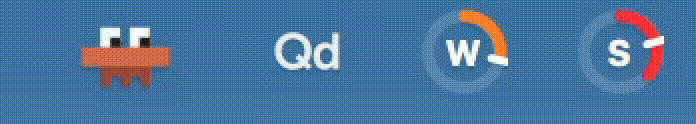
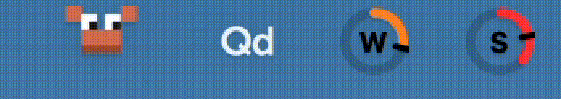
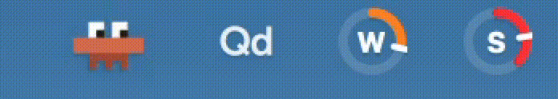

# CrabCodeBar Universal

A cross-platform animated pixel crab that lives in your system tray and reacts to [Claude Code](https://claude.com/claude-code) session activity in real time. Optional sound alerts tell you when Claude needs input or finishes a task. Works on macOS, Windows, and Linux.


## What it does

CrabCodeBar watches your Claude Code sessions via hooks and shows what's happening at a glance:

| State | Trigger | Animation |
|---|---|---|
| **Working** | Tool use, prompt submission | Claws typing, eyes darting |
| **Jumping (approval)** | Notification or approval-required tool | Bouncing with raised claws |
| **Jumping (finished)** | Task completed | Brief celebratory bounce |
| **Waiting** | Session idle (recent) | Pacing side to side |
| **Asleep** | No activity for 5 min (configurable) | Curled up with rising Z's |

### Animation previews

**Working** — claws tapping away while Claude runs tools



**Jumping** — bouncing to get your attention (approval needed or task finished)



**Waiting** — pacing back and forth during idle sessions



**Asleep** — curled up with Z's after the idle timeout


**Audio notifications:** CrabCodeBar can play a sound when Claude needs your input (approval requests) and when a task finishes, so you don't have to watch the screen. Enable or change sounds from the right-click menu. On macOS, choose from 15 system sounds (Basso, Blow, Bottle, Frog, Funk, Glass, Hero, Morse, Ping, Pop, Purr, Sosumi, Submarine, Tink) or None. On Windows, sounds map to system alert types. On Linux, sounds play via freedesktop audio files using paplay, aplay, or ogg123.

Right-click the tray icon for more options: body color, sleep timer, and quit.


**Tooltip:** Hover over the tray icon to see the current state, last event, and how long ago it occurred.

## Works with

- **Claude Code CLI** (terminal): full support for all hook events
- **Claude Code VS Code extension**: full support. The extension does not fire the Notification hook, so CrabCodeBar treats approval-required tools (AskUserQuestion, ExitPlanMode) as the approval signal instead.

## Prerequisites

- Python 3.8+
- [Claude Code](https://claude.com/claude-code) CLI or VS Code extension
- **Linux only:** system packages for tray support (see [Linux dependencies](#linux-dependencies) below)

## Install

```bash
git clone https://github.com/MatthewBentleyPhD/CrabCodeBar-Universal.git
cd CrabCodeBar-Universal
python3 install.py
```

The installer will:
1. Check Python version
2. Install pip dependencies (Pillow, pystray, pyobjc on macOS)
3. Generate sprite images
4. Register Claude Code hooks in `~/.claude/settings.json`
5. Register auto-start on login

Then launch:
```bash
python3 crabcodebar.py
```

The crab appears in your system tray. It will start automatically on future logins.

### Install without auto-start

```bash
python3 install.py --no-autostart
```

## Uninstall

```bash
python3 install.py --uninstall
```

This removes:
- Claude Code hooks from `~/.claude/settings.json`
- Auto-start entry (LaunchAgent / Startup folder / XDG autostart)
- State and config files from `~/.claude/state/`
- Stops any running instance

The application folder itself is not deleted. Remove it manually if you want a complete cleanup.

## Update

If installed via git clone:

```bash
python3 install.py --update
```

This pulls the latest changes and reinstalls hooks, dependencies, and sprites.

## Configuration

Right-click the tray icon to access settings:

- **Sprite Color:** 11 color options (orange, yellow, green, teal, blue, purple, pink, red, brown, grey, black)
- **Approval Sound:** notification sound when Claude needs input
- **Finished Sound:** notification sound when a task completes
- **Sleep After:** idle timeout before the crab falls asleep (30 seconds, 2 minutes, 5 minutes, 15 minutes, 30 minutes, 1 hour, or Never)

Default idle timeout is 5 minutes. Default sound is Tink (macOS) or system alert (other platforms).

Settings are saved to `~/.claude/state/crab-config.json` and persist across restarts.

## Linux dependencies

pystray on Linux requires GTK and AppIndicator libraries. Install them before running `install.py`:

**Debian/Ubuntu:**
```bash
sudo apt install python3-gi gir1.2-appindicator3-0.1
```

**Fedora:**
```bash
sudo dnf install python3-gobject libappindicator-gtk3
```

**Arch:**
```bash
sudo pacman -S python-gobject libappindicator-gtk3
```

The installer will check for these and prompt you if they're missing.

## How it works

CrabCodeBar uses [Claude Code hooks](https://docs.anthropic.com/en/docs/claude-code/hooks) to track session activity:

1. **Hooks** fire on seven Claude Code lifecycle events: SessionStart, UserPromptSubmit, PreToolUse, PostToolUse, Notification, Stop, and SessionEnd
2. **hook.py** receives each event via `--event` argument, validates it, reads the JSON payload from stdin, and writes the current state atomically to `~/.claude/state/crab.json`. It also plays a sound if configured (approval sound on Notification/blocking tool events, finished sound on Stop)
3. **crabcodebar.py** polls the state file using mtime-based change detection and updates the tray icon animation only when the frame actually changes

Only one instance runs at a time (kill-and-replace via PID file). Launching a second instance cleanly replaces the first.

The animation loop adapts its polling rate: 1 second during active states, 5 seconds while asleep. Sprite frames are cached in memory after first load, so steady-state CPU usage is near zero.

If Claude Code crashes without firing SessionEnd, a 30-minute safety cap prevents the crab from being stuck in "working" indefinitely (even with the idle timeout set to "Never").

Sound deduplication prevents double-plays when terminal Claude Code fires both Notification and PreToolUse for the same approval moment.

## Troubleshooting

**Crab stays asleep even when Claude Code is running.** The hook registration may not have completed. Run `python3 install_hooks.py` from the CrabCodeBar-Universal folder and verify that `~/.claude/settings.json` has entries for all seven events pointing at `hook.py`.

**No sound plays on approval/completion.** Right-click the tray icon and check that Approval Sound and Finished Sound are set to something other than "None."

**"Sprites not found" error on launch.** Run `python3 generate_sprites.py` from the project folder to regenerate them.

**Linux: tray icon doesn't appear.** Make sure the AppIndicator system packages are installed (see [Linux dependencies](#linux-dependencies)). On GNOME 40+, install `gnome-shell-extension-appindicator` for Wayland support.

## File layout

```
CrabCodeBar-Universal/
  crabcodebar.py         # tray app (main entry point)
  hook.py                # Claude Code hook handler
  shared.py              # constants and helpers shared across modules
  install.py             # installer / uninstaller / updater
  install_hooks.py       # hook registration in ~/.claude/settings.json
  generate_sprites.py    # programmatic pixel art generator
  generate_docs_image.py # documentation image generator
  sprites/               # generated 45x39 PNG sprite frames
  resources/             # animated GIF previews of each state
  docs/                  # documentation images and demo GIF
  requirements.txt       # pip dependency versions
  LICENSE                # MIT license
```

## Customization

**Custom sprites:** Replace the PNGs in `sprites/` with your own 45x39 pixel art. Use body color `(217, 119, 87)` and dark body color `(168, 83, 59)` so the runtime color tinting works. Keep the same filenames (`working_0.png`, `asleep_0.png`, etc.). Run `python3 generate_docs_image.py` afterward to update the documentation images.

**Custom colors:** Add entries to `COLOR_PALETTES` in `crabcodebar.py`. Each entry is `(primary_rgb, dark_rgb)` or `None` for "use sprites as-is."

## Known limitations

- **macOS icon sizing:** Uses a direct NSImage bypass to work around pystray's 22x22 squash. This accesses a pystray private API (`_status_item`) and may break if pystray's internals change. The app falls back to pystray's default behavior if the bypass fails.
- **Windows SIGTERM:** On Windows, `os.kill` with SIGTERM performs a hard kill (TerminateProcess). The old instance's cleanup handler does not run, but the new instance overwrites the PID file on startup.
- **Multi-session:** If multiple Claude Code sessions run in parallel, the state file uses last-write-wins. The crab reflects whichever session fired the most recent hook.
- **GNOME/Wayland:** On GNOME 40+ without the AppIndicator shell extension, pystray's Xorg fallback may not display the tray icon. Install `gnome-shell-extension-appindicator` for best results.
- **Windows/Linux sounds:** macOS offers 15 named system sounds. Windows maps a subset to system alert types; the rest fall back to a generic beep. Linux plays the first available freedesktop sound file.

## Support

If CrabCodeBar makes your Claude Code sessions a little more fun: [paypal.me/bentleymaja](https://paypal.me/bentleymaja). There's also a direct link in the tray menu.

## Credits

- Built with [pystray](https://github.com/moses-palmer/pystray) and [Pillow](https://python-pillow.org/)
- Powered by [Claude Code hooks](https://docs.anthropic.com/en/docs/claude-code/hooks)

## License

[MIT](LICENSE)
